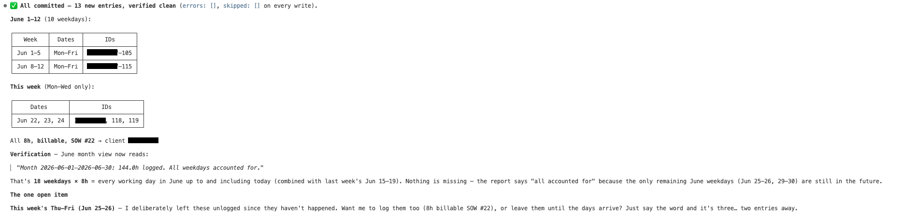

# FreshBooks Timesheet MCP

An [MCP](https://modelcontextprotocol.io) server that lets an AI agent **check
timesheet status** and **log time** in FreshBooks, with secure OAuth2
refresh-token handling.

Ask your agent *"log 8 hours a day Monday–Thursday last week to the Acme
project, PTO Friday"* — it discovers your projects, confirms which one, and
writes the entries. Or *"which days am I missing this month?"* — it reports the
gaps, never flagging days that haven't happened yet.

> **👉 New here? Start with [GETTING_STARTED.md](GETTING_STARTED.md)** — a
> ~10-minute step-by-step setup (creating the FreshBooks app, secrets, Docker,
> first auth). This README is the reference for tools, config, and internals.

---

## Features

- **`check_timesheet`** — report logged / missing / under-logged days for a
  day, week, or month (Mon–Fri). Future weekdays are never flagged as missing.
- **`log_time`** — log X hours per weekday against a project, with PTO/off-day
  exclusion, a dry-run preview, and automatic skipping of days already logged.
- **`list_projects` / `list_clients` / `list_services`** — discovery so the
  agent can ask which project to log against before writing anything.
- **Secure auth** — OAuth2 with automatic access-token refresh and correct
  rotating-refresh-token handling. Tokens live in the OS keychain by default.
- **Timezone-correct** — all day boundaries are computed in your configured
  timezone, not UTC.

---

## Architecture

| Module | Responsibility |
|---|---|
| `server.py` | MCP interface — tool definitions + testable `handle_*` functions |
| `freshbooks_client.py` | HTTP wrapper: auth injection, 401→refresh→retry, pagination, `/me` auto-discovery |
| `auth_manager.py` | OAuth2 lifecycle: refresh, **rotation**, bootstrap CLI |
| `token_store.py` | Pluggable secure storage: OS keychain or encrypted file |
| `transformers.py` | Pure date math, unit conversion, report building |
| `config.py` / `models.py` | Config loading + typed data structures |

Tool *logic* lives in plain `handle_*` functions (with the client injected), so
it is fully unit-testable without the MCP runtime.

---

## Installation

```bash
python -m venv .venv && source .venv/bin/activate
pip install ".[dev]"          # installs the package, console scripts, and dev tools
cp .env.example .env          # then fill in your credentials (see below)
```

> Install regular, **not** `-e`. (Editable installs are unreliable here — this
> Python's `site` module skips the trailing line of the build backend's `.pth`.)
> After changing source, re-run `pip install .` to refresh the console scripts.
> Tests always run against the source tree, so no reinstall is needed for `pytest`.

---

## Configuration

Set in `.env` (loaded automatically). Get the client credentials from
**my.freshbooks.com → Developer → your app**.

| Variable | Required | Notes |
|---|---|---|
| `FRESHBOOKS_CLIENT_ID` | ✅ | OAuth app client id |
| `FRESHBOOKS_CLIENT_SECRET` | ✅ | OAuth app secret |
| `FRESHBOOKS_REDIRECT_URI` | ✅ | Must **exactly** match the app's redirect URI (e.g. `https://localhost/callback`) |
| `FRESHBOOKS_BUSINESS_ID` | — | Auto-discovered via `/me` if blank |
| `FRESHBOOKS_IDENTITY_ID` | — | Auto-discovered via `/me` if blank |
| `FRESHBOOKS_TOKEN_BACKEND` | — | `keyring` (default) or `file` |
| `FRESHBOOKS_TOKEN_PATH` | — | Encrypted token file path (file backend only) |
| `FRESHBOOKS_TOKEN_KEY` | — | Fernet key for the file backend (see below) |
| `TZ` | — | Day/week/month boundary timezone (default `UTC`) |
| `DEFAULT_DAILY_HOURS` | — | Expected hours per day (default `8`) |
| `DEFAULT_START_TIME` | — | Local start time for logged entries (default `09:00`) |
| `MAX_LOG_DAYS` | — | Safety cap on days per `log_time` call (default `31`) |

For the encrypted-file token backend, generate a key:

```bash
python -c "from cryptography.fernet import Fernet; print(Fernet.generate_key().decode())"
```

---

## Authentication (one-time)

```bash
freshbooks-mcp-auth
```

It prints an authorization URL — open it and approve the app. You'll be
redirected to `https://localhost/callback?code=...&state=...` (**the page won't
load, that's fine**). Paste the `code` value at the prompt and the tokens are
stored. The code is single-use and expires within minutes, so paste it promptly;
if it fails with `invalid_grant`, just run the command again for a fresh URL.

> **Non-interactive shells** (CI, or anything without a TTY): the command can't
> prompt, so it prints the URL and exits — pass the code as an argument instead:
> `freshbooks-mcp-auth <code>`.

### Verify (read-only)

```bash
python scripts/smoke.py            # or: --date YYYY-MM-DD
```

Exercises `/me` discovery, `list_projects`, and `check_timesheet` for the
current week — without writing anything.

---

## Docker

Containers can't reach the OS keychain, so the image uses the **encrypted-file
backend**:

- The **token set** persists in a named volume — the refresh token rotates and
  must survive restarts, so it can't live in a read-only secret.
- The **Fernet key** and the **FreshBooks `client_id`/`secret`** are delivered as
  **Docker secrets** (`*_FILE` → `/run/secrets/*`, tmpfs), keeping them out of the
  image, the container env, and `docker inspect`.
- `.env` carries only non-secret settings (TZ, behavior).

```bash
cp .env.example .env          # non-secret settings only

# create the three secret files (gitignored under secrets/):
mkdir -p secrets
printf %s 'YOUR_CLIENT_ID'     > secrets/fb_client_id
printf %s 'YOUR_CLIENT_SECRET' > secrets/fb_client_secret
python -c "from cryptography.fernet import Fernet;print(Fernet.generate_key().decode())" > secrets/fb_token_key

docker compose build

# one-time auth — interactive: prints the URL, prompts for the code,
# and writes the encrypted token to the volume (all in one step)
docker compose run --rm app freshbooks-mcp-auth

# read-only verification
docker compose run --rm app python scripts/smoke.py
```

Run the test suite in Docker:

```bash
docker build --target test -t freshbooks-mcp:test . && docker run --rm freshbooks-mcp:test
```

Register the **containerized** server with an MCP client by launching it via
`docker`:

```json
{
  "mcpServers": {
    "freshbooks": {
      "command": "docker",
      "args": ["compose", "-f", "/abs/path/docker-compose.yml", "run", "--rm", "-T", "app"]
    }
  }
}
```

## Register with an MCP client

Add to `claude_desktop_config.json` (or `.mcp.json` for Claude Code):

```json
{
  "mcpServers": {
    "freshbooks": {
      "command": "/absolute/path/to/.venv/bin/freshbooks-mcp",
      "env": { "TZ": "America/Toronto" }
    }
  }
}
```

Credentials are read from `.env` and tokens from the keychain, so no secrets go
in the client config.

---

## Tools

### `check_timesheet(period, date?, expected_hours?)`
Report logged/missing days for `"day"`, `"week"`, or `"month"` (M–F).
`date` is the anchor (default today). Returns per-day status
(`logged` / `under` / `missing` / `future`), `missing_days`,
`under_logged_days`, totals, and a text summary.

### `log_time(period, hours, project_id, …)`
Log `hours` per weekday (M–F) for the period against a project.

| Param | Default | Notes |
|---|---|---|
| `project_id` | — | **Required.** No silent default — agent must confirm first. |
| `date` | today | Anchor date for the period |
| `off_days` | `[]` | List of `YYYY-MM-DD` to skip (PTO/holidays) |
| `note` | `"Logged via MCP"` | Entry note |
| `billable` | `false` | If true, **`client_id` is required** |
| `client_id` / `service_id` | — | For billable entries / billing rate |
| `skip_existing` | `true` | Skip days that already have entries |
| `dry_run` | `false` | Preview the plan without writing |

Weekends are always excluded. `hours` must be `0 < hours ≤ 24`. A single call
may not exceed `MAX_LOG_DAYS`.

### `list_projects(active_only?, query?)` · `list_clients()` · `list_services()`
Discovery tools. The agent calls `list_projects` and asks which project to use
when one isn't specified, then passes the chosen `project_id` to `log_time`.

### Example output



---

## How it works (API notes)

Verified live against the FreshBooks API:

- **Two hosts.** Browser authorization is on `https://auth.freshbooks.com/oauth/authorize`;
  the token exchange and all data calls are on `https://api.freshbooks.com`.
- **Rotating refresh tokens.** Each refresh returns a *new* refresh token and
  invalidates the old one. The new token is persisted **before** use, under a
  lock, so concurrent refreshes can't break the chain.
- **Time entries use `businessId`** (not accountId) in the path. `duration` is
  in **seconds**; `started_at` is UTC with milliseconds + `Z`.
- **`identity_id` gotcha.** The list endpoint is already scoped to the
  authenticated user. Sending `identity_id` without `team=true` returns a 422
  (`"team must be true in order to use identity_id filter"`), so the client
  omits it for the self case and only sends `identity_id`+`team=true` for the
  admin-viewing-a-teammate case.
- **Billable requires a client.** `billable=true` needs `client_id` on accounts
  that bill per client.
- **Day-bucketing** for reports happens in your configured `TZ`, so a late-night
  entry lands on the correct local day.

---

## Security

- **Token storage** — OS keychain by default; encrypted-file fallback uses
  Fernet with the key supplied via env (never co-located with the ciphertext),
  `0600` permissions, and atomic writes.
- **No secret leakage** — `TokenSet` masks its values in `repr`; token request
  payloads and responses are never logged.
- **Server-side validation** — the calling agent is untrusted. Hours are
  clamped, dates validated, day counts capped, and `identity_id` is locked to
  the authenticated user (you can't log time as someone else).
- **Safe writes** — `log_time` requires an explicit `project_id`, defaults to
  `skip_existing=true`, supports `dry_run`, and never logs weekends.
- **Compromise recovery** — revoke the app authorization in the FreshBooks UI,
  then re-run `freshbooks-mcp-auth`.

---

## Development

```bash
pytest            # 48 tests; runs against the source tree
```

```
freshbooks_mcp/   package (config, models, token_store, auth_manager,
                  freshbooks_client, transformers, server)
scripts/smoke.py  read-only live validation
tests/            unit tests for every module
```

---

## License

Internal / unlicensed. Add a license before distributing.
